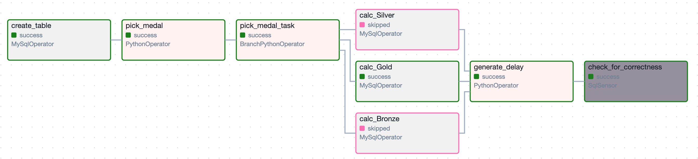
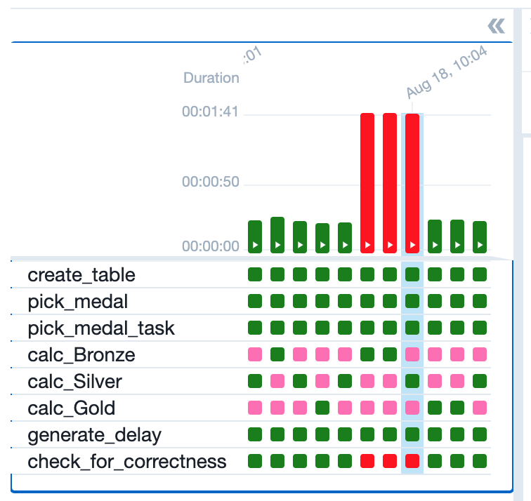
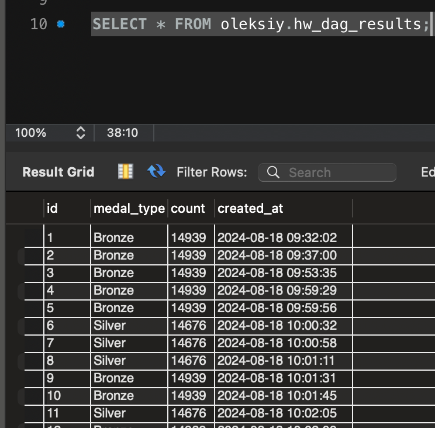
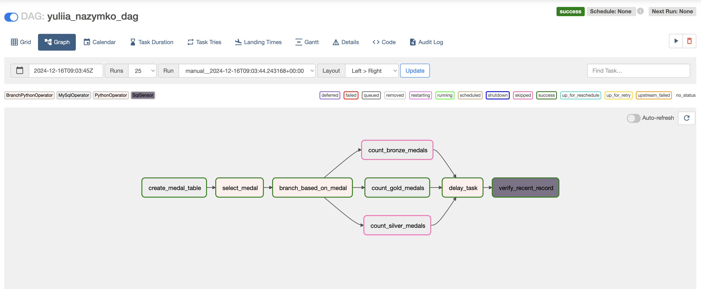
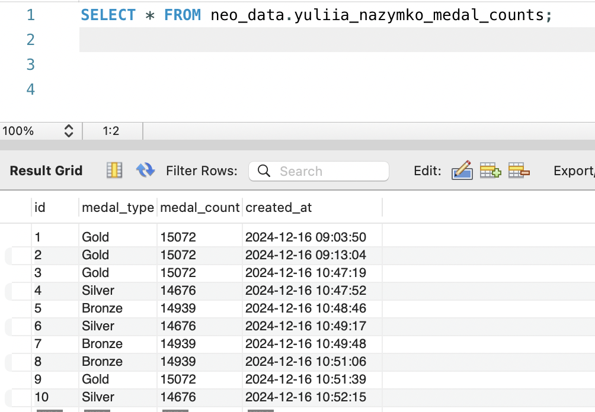

# Домашнє завдання до теми “Apache Airflow”

Вітаю в домашньому завданні до теми «Apache Airflow»! 🙂

Ваше завдання сьогодні — **реалізувати DAG із використанням вивчених операторів,
щоб виконати певний перелік прикладних завдань.**

Це завдання допоможе вам закріпити знання з Apache Airflow для роботи з MySQL
базами даних, опанувати логіку розгалуження DAG, залежно від результатів
виконання попередніх завдань, закріпити вміння працювати із затримками виконання
завдань у DAG.

Воно також допоможе вам краще зрозуміти, як керувати процесами обробки даних в
Apache Airflow, і підготує до розв’язання більш складних сценаріїв роботи з
даними.

Починаємо?! 😉

## Покрокова інструкція виконання

Напишіть DAG, що має такі завдання (кожен пункт → одне завдання/task):

1. Створює таблицю.

> [!NOTE]
>
> 👉🏻 Використайте IF NOT EXISTS з полями
>
> id (автоінкремент, головний ключ),
>
> medal_type,
>
> count,
>
> created_at.

2. Випадково обирає одне із трьох значень ['`Bronze`', '`Silver`', '`Gold`'].

3. Залежно від обраного значення запускає одне із трьох завдань (розгалуження).

4. Опис трьох завдань:

1) Завдання рахує кількість записів у таблиці
   `olympic_dataset.athlete_event_results`, що містять запис `Bronze` у полі
   `medal`, та записує отримане значення в таблицю, створену в пункті 1, разом
   із типом медалі та часом створення запису.

2) Завдання рахує кількість записів у таблиці
   `olympic_dataset.athlete_event_results`, що містять запис `Silver` у полі
   `medal`, та записує отримане значення в таблицю, створену в пункті 1, разом
   із типом медалі та часом створення запису.

3) Завдання рахує кількість записів у таблиці
   `olympic_dataset.athlete_event_results`, що містять запис `Gold` у полі
   `medal`, та записує отримане значення в таблицю, створену в пункті 1, разом
   із типом медалі та часом створення запису.

5. Запускає затримку виконання наступного завдання.

> [!NOTE]
>
> 👉🏻 Використайте PythonOperaor із функцією time.sleep(n), якщо одне з трьох
> попередніх завдань виконано успішно.

6. Перевіряє за допомогою сенсора, чи найновіший запис у таблиці, створеній на
   етапі 1, не старший за 30 секунд (порівнюючи з поточним часом). Ідея в тому,
   щоб упевнитися, чи справді відбувся запис у таблицю.

> [!NOTE]
>
> 👉🏻 За допомогою задачі затримки на етапі 5 ви можете створити затримку 35
> секунд для того, щоб упевнитися, що сенсор справді «падає», якщо затримка
> більша за 30 секунд.

## Критерії прийняття та оцінювання ДЗ

> [!WARNING]
>
> ☝🏻 Критерії прийняття домашнього завдання є обов’язковою умовою оцінювання
> домашнього завдання ментором. Якщо якийсь із критеріїв не виконано, ментор
> поверне ДЗ на доопрацювання без оцінювання. Якщо вам «тільки уточнити»😉 або
> ви застопорилися на якомусь з етапів виконання — звертайтеся до ментора у
> Slack)

1. Створення таблиці (10 балів).

2. Генерація випадкового значення (10 балів).

3. Розгалуження: запуск одного із трьох завдань залежно від обраного значення
   (15 балів).

4. Виконання завдань з рахування кількість записів у таблиці (25 балів).

5. Реалізація затримки виконання наступного завдання (15 балів).

6. Перевірка, чи найновіший запис у таблиці не старший за 30 секунд (25 балів).

Загальна максимальна кількість балів: 100.

Якщо є помилки або недоліки виконання, кількість балів на кожному етапі
зменшується пропорційно до наявних помилок на розсуд ментора.

> [!CAUTION]
>
> 💡 УВАГА!! У вас є можливість обрати підхід до виконання та можливого
> доопрацювання домашнього завдання:
>
> 1. задовольнитися першою отриманою оцінкою (звісно ж, якщо вона вища за
>    прохідний бал),
> 2. намагатися отримати вищий бал шляхом можливого подальшого доопрацювання
>    роботи відповідно до фідбеку ментора.
>
> Обраний підхід до виконання ДЗ необхідно зазначити в полі для здачі до
> прикріпленого завдання. За відсутності коментаря ментор дотримується першого
> підходу й виставляє отриману оцінку.

> [!NOTE]
>
> 💡 Відправляйте ДЗ на перевірку, коли зроблено все можливе, адже кількість
> спроб здачі завдання впливає на отриманий бал! За кожну наступну спробу після
> другої (тобто з третьої) максимально можлива кількість балів зменшується на 5.
> Критерії оцінювання робіт у магістратурі GoIt Neoversity

## Підготовка та завантаження домашнього завдання

1. Створіть публічний репозиторій `goit-de-hw-07`.

2. Виконайте завдання та відправте у свій репозиторій код та скриншоти таблиці з
   даними і елементів Airflow UI у текстовому документі з коротким описом
   виконання завдання.

**Мають бути наведені також приклади, де затримка більше 30 секунд, щоб
продемонструвати «failed» роботу сенсора,** наприклад:

3. Створіть один архів, що містить весь код виконання завдання, та текстовий
   документ із скриншотами, прикріпіть його в LMS. Назва архіву повинна бути у
   форматі ДЗ7_ПІБ.

4. Прикріпіть посилання на репозиторій `goit-de-hw-07` і відправте на перевірку.

## Формат здачі

- Посилання на репозиторій `goit-de-hw-07`.
- Прикріплений архів із назвою ДЗ7_ПІБ.

### Результат виконаного завдання № 1

### Результат виконаного завдання № 2

### Результат виконаного завдання № 3

